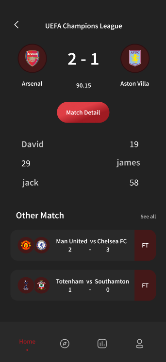

#  RedCard
## Live Football Scores App

**RedCard** is an Android application designed for football enthusiasts to stay updated with live match scores, team standings, and league information. The app emphasizes simplicity, speed, and a user-friendly interface, ensuring fans can effortlessly follow their favorite teams and matches in real time.

##  Features

- Real-time match scores and statistics
- League standings and team rankings
- Match schedule including upcoming games
- Personalized notifications and user preferences
- Smooth and intuitive user experience

##  API Features

The RedCard app connects to a third-party API that provides comprehensive football data. Key features of the API include:

- **Live Matches**: Real-time data on ongoing matches
- **Upcoming Matches**: Schedule of future matches across leagues
- **League Tables**: Live standings and rankings for different leagues
- **Match Details**: In-depth statistics, scores, and event timelines for each match

##  Technologies Used

- **Programming Language**: Kotlin
- **UI Framework**: Jetpack Compose
- **Local Database**: Room
- **API**: Third-party football data provider
- **Design Prototype**: [Figma Design](https://www.figma.com/design/ANlC1OWVBRIGCczCjJmJyS/soccer-app?node-id=0-1&p=f)

##  Database Schema

The application employs Room for local data storage, with the following tables:

- `Users`: Stores user information and preferences
- `Matches`: Contains details about matches, including teams, dates, and times
- `Leagues`: Holds data on various leagues, standings, and team statistics

## 📸 Screenshots

| Home Screen | Match Details | League Standings |
|-------------|---------------|------------------|
|  |  |  |

| Upcoming Matches | Standing | Splash Screen |
|------------------|--------|---------------|
|  |  |  |

## 👨‍💻 Development Team

- **[Masoud Mohammadzadeh](https://github.com/MasoudMohammadZadeh)**
- **[Saber Sabzi](https://github.com/1381saber)**  
- **[Mohammad Kazem Harandi](https://github.com/mohammadkahr)**

**Supervisor**: Navid Shirmohammadi  
**Institution**: University of Isfahan, Faculty of Computer Engineering